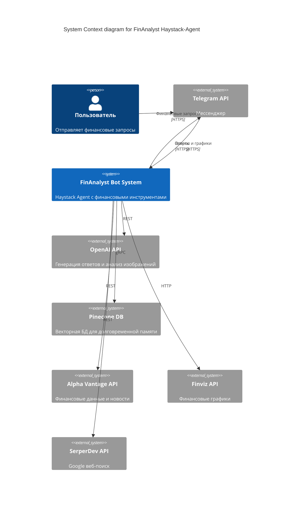
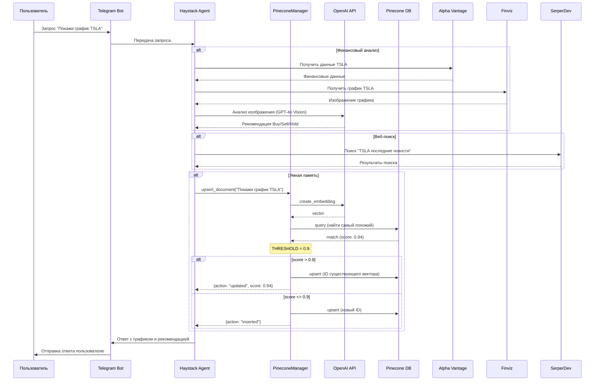

# FinAnalyst Haystack-Agent Telegram Bot

Умный финансовый ассистент на базе фреймворка **Haystack 2.x**, использующий **Pinecone** для долговременной памяти и **Telegram** как интерфейс взаимодействия. Предоставляет финансовые факты, анализ графиков и веб-поиск через Google.

## 🚀 Основные возможности

- **Haystack 2.x Agent**: Современный агентный подход для построения сложных LLM-приложений.
- **Долговременная память (Pinecone)**: Сохранение только текстовых сообщений пользователей в векторной базе данных с использованием `PineconeDocumentStore`.
- **Инструменты (Tools)**:
    - **Финансовые факты**: Получение актуальных данных через Alpha Vantage API (детерминированно, без случайности).
    - **Анализ графиков**: Автоматическое получение графиков финансовых инструментов (через Finviz) и их глубокий анализ с помощью **OpenAI Vision (GPT-4o)**. Поддерживает запросы типа "Покажи график TSLA".
    - **Веб-поиск**: Выполнение поиска в Google через SerperDevWebSearch API для получения актуальной информации.
    - **Мультимодальность**: Бот умеет отправлять не только текст, но и изображения графиков с экспертными рекомендациями (Buy/Sell/Hold).
- **Мультимодальность**: Бот умеет отправлять не только текст, но и изображения графиков с экспертными рекомендациями (Buy/Sell/Hold).
- **Продвинутое логирование**: Использование **Loguru** для отслеживания работы инструментов и состояния системы.
- **Поддержка ProxyAPI**: Настройка `OPENAI_BASE_URL` для обхода ограничений.

## ⚙️ Настройка (Environment Variables)

Создайте или обновите файл `.env`:

```env
# Pinecone
PINECONE_API_KEY=ваш_ключ
PINECONE_INDEX_NAME=haystack-agent

# OpenAI / ProxyAPI
PROXY_API_KEY=ваш_ключ
OPENAI_BASE_URL=https://api.openai.com/v1
EMBEDDING_MODEL=text-embedding-3-small
CHAT_MODEL=gpt-4o-mini

# Telegram
TELEGRAM_BOT_TOKEN=токен_от_BotFather

# Alpha Vantage
ALPHAVANTAGE_API_KEY=ваш_ключ_или_demo
# SerperDevWebSearch (Google Search)
SERPERDEV_API_KEY=ваш_serperdev_api_key
# Finage Financial Data API
FINAGE_API_KEY=ваш_finage_api_key
```

## 🛠 Запуск

1. Установите зависимости:
```bash
pip install -r requirements.txt
```

2. Запустите бота:
```bash
python hay/hay-tg_bot.py
```

## 📊 Логирование

Логи сохраняются в директории `logs/`:
- `app.log`: Общие логи приложения.
- `tools.log`: Детальные логи работы инструментов (фильтрация по тегу `tool`).

## 🛠 Архитектура

### C4 System Context Diagram

<div align="center">
<div style="background-color: white; padding: 20px; border-radius: 10px;">



</div>
</div>

### UML Sequence Diagram: Финансовый анализ и "Умная память"

<div align="center">
<div style="background-color: white; padding: 20px; border-radius: 10px;">



</div>
</div>

## 📦 Установка и Запуск

1. **Установите зависимости**:
   ```bash
   pip install -r requirements.txt
   ```

2. **Проверьте ядро (PineconeManager)**:
   ```bash
   python pinecone_manager.py
   ```
   *Запустится встроенный тест: проверка связи, запись документа и проверка дубликата.*

3. **Запустите бота**:
   ```bash
   python hay/hay-tg_bot.py
   ```

## 📂 Структура проекта

- [hay/hay-tg_bot.py](file:///c:/GitHub/Haystack-Agent/hay/hay-tg_bot.py): Основной Telegram-бот с Haystack Agent, инструментами финансового анализа и веб-поиска.
- [pinecone_manager.py](file:///c:/GitHub/Haystack-Agent/pinecone_manager.py): Класс `PineconeManager` с логикой косинусного сходства и поддержкой OpenAI.
- [requirements.txt](file:///c:/GitHub/Haystack-Agent/requirements.txt): Зависимости проекта.
- [.env](file:///c:/GitHub/Haystack-Agent/.env): Конфигурация (необходимо создать).
- [bot.py](file:///c:/GitHub/Haystack-Agent/bot.py): Альтернативный Telegram-бот (простая реализация без Haystack агента).

## 🖼 Скриншоты работы

### Интерфейс Telegram-бота
| Похожее сообщение | Обновление записи | Статистика |
|:---:|:---:|:---:|
|  |  |  |

### Работа в терминале (Логирование)


### Панель управления Pinecone

